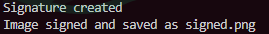

# 🛡️ Image Signing and Verification System

Цей проєкт реалізує систему цифрового підпису зображень із використанням спеціального стеганографічного методу — **LSB Stego-pattern embedding**.  
Підпис вбудовується у найменш значущі біти червоного каналу зображення за певним шаблоном розміщення бітів.

---

## 📖 Опис методу

### Основна ідея:

- Вбудувати цифровий підпис у зображення таким чином, щоб це було важко виявити без знання конкретного шаблону.
- Використовується спеціальний шаблон: пікселі, у яких `(x + y) % 16 == 0`, де `x` та `y` — координати пікселя.
- Підпис вбудовується **у найменш значущий біт червоного каналу** обраних пікселів.
- При перевірці підпис витягується з тих самих пікселів і перевіряється за допомогою відкритого ключа.

---

## 📦 Процеси

### Створення підписаного зображення (`make_signature.py`)

1. Завантажується приватний RSA-ключ.
2. Обчислюється SHA-256 хеш вихідного зображення.
3. Хеш підписується приватним ключем.
4. Підпис конвертується у бітову послідовність.
5. Біти підпису вбудовуються в LSB червоної компоненти пікселів згідно з шаблоном `(x + y) % 16 == 0`.
6. Створене підписане зображення зберігається у файл (`signed.png`).

### Перевірка підпису (`verification.py`)

1. Завантажується відкритий RSA-ключ.
2. Витягується бітова послідовність підпису з LSB червоної компоненти пікселів за шаблоном `(x + y) % 16 == 0`.
3. Підпис конвертується назад у байтовий формат.
4. Обчислюється SHA-256 хеш оригінального зображення.
5. Виконується перевірка автентичності підпису за допомогою відкритого ключа.
6. Виводиться результат перевірки: зображення автентичне або змінене.

---

## 🛠️ Детальний опис функцій

### `make_signature.py`

- `load_private_key(private_key_path)`
  - Завантажує приватний RSA-ключ із файлу у форматі PEM.
  
- `create_image_signature(image_path, private_key)`
  - Обчислює SHA-256 хеш байтового представлення зображення.
  - Підписує цей хеш за допомогою приватного ключа.
  - Повертає цифровий підпис у вигляді байтів.
  
- `embed_signature(image_path, signature, save_path)`
  - Перетворює підпис у послідовність бітів.
  - Проходить по пікселях і вбудовує біти у червоний канал у пікселях, де `(x + y) % 16 == 0`.
  - Зберігає нове зображення у вказаний файл (signed.png).

---

### `verification.py`

- `load_public_key(public_key_path)`
  - Завантажує відкритий RSA-ключ із файлу у форматі PEM.

- `extract_signature(image_path, signature_bytes)`
  - Відкриває зображення і витягує біти підпису з пікселів за шаблоном `(x + y) % 16 == 0`.
  - Перетворює витягнуті біти назад у байти.

- `verify_signature(original_image_path, signed_image_path, public_key)`
  - Обчислює хеш оригінального зображення.
  - Завантажує підпис із підписаного зображення.
  - Перевіряє підпис на автентичність за допомогою публічного ключа.
  - Виводить результат перевірки.

---

## 🧠 Особливості методу

- **Stego-pattern embedding** дозволяє зробити процес вбудовування менш передбачуваним і менш помітним.
- Змінюється тільки найменш значущий біт червоного каналу, що мінімізує візуальні спотворення.
- Шаблон `(x + y) % 16 == 0` визначає, у які пікселі записуються біти, що дозволяє краще контролювати розподіл вбудованої інформації.
- Шаблон можна міняти, тобто для себе визначити у які пікселі записувати біти
- Можна записувати не тільки у червоний канал, а і в зелений чи синій, або ж комбіновано у різні канали одночасно

---

## 🛡️ Безпекові властивості
- Будь-яка зміна пікселів у зображенні змінить підпис і зробить його недійсним.

- Навіть мінімальні модифікації (наприклад, зміна одного біта) будуть виявлені.

- Без приватного ключа створити валідний підпис неможливо.


## ⚡ Використання

### Встановлення бібліотек
```python
pip install -r requirements.txt
```
Потрібно **Python 3.10+**

### Створення RSA-ключів

```python
from Crypto.PublicKey import RSA

key = RSA.generate(4096)
with open("private_key.pem", "wb") as f:
    f.write(key.export_key())
with open("public_key.pem", "wb") as f:
    f.write(key.publickey().export_key())
```
Вони вже є завантажені відповідно - **public_key.pem** та **private_key.pem**

### Підписання зображення
```python
py make_signature.py
```
Потрібно мати зображення з назвою **original.png** (таке вже є у репозиторії) <br>


### Перевірка підпису за допомогою публічного ключа

```python
py verification.py
```
Виведе чи є валідним підпис чи не є таким <br>
Приклади виводу:
- Валідний !(example_2.png)
- Невалідний !(example_3.png)


## 📘 Джерела
- [Steganography LBS Image Based](https://www.researchgate.net/publication/353598043_A_LSB_Based_Image_Steganography_Using_Random_Pixel_and_Bit_Selection_for_High_Payload)
- [PyCryptodome](https://pycryptodome.readthedocs.io/en/latest/index.html)
